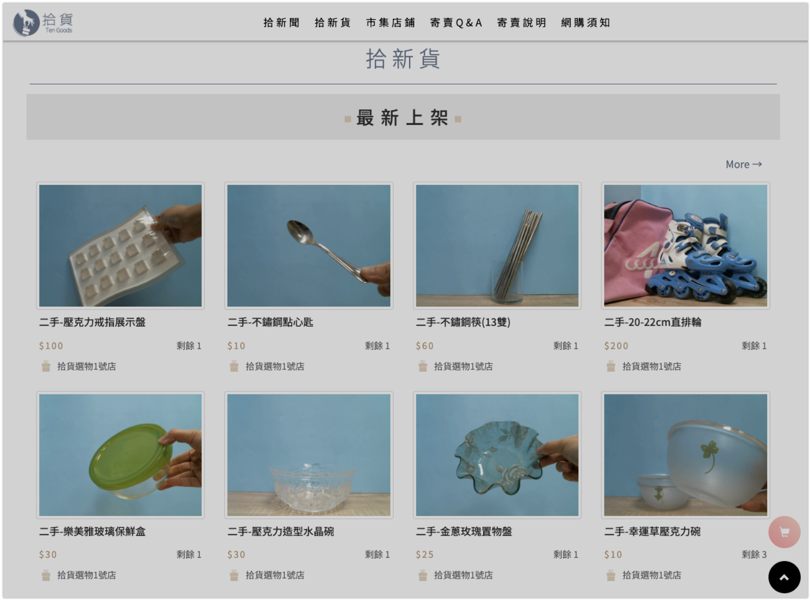
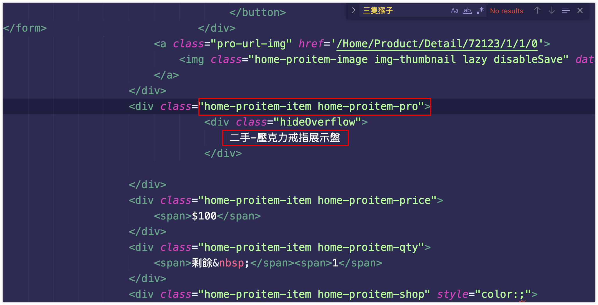
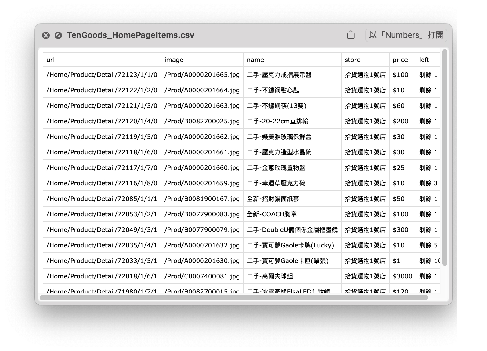

# 網路爬蟲練習
### 目標網頁
[首頁|拾貨選物](https://www.tengoods.com.tw/)


### 定義預計抓取的物件結構
```json
{
    "url",    //網站連結
    "image",  //圖片  
    "name",   //名稱
    "store",  //店面  
    "price",  //價錢
    "left"    //庫存
}
```

### 使用curl指令抓取原始碼
```bash
curl -o output.html -L -c cookies.txt -b cookies.txt -A "User-Agent-String" "https://www.tengoods.com.tw/"
```

### 檢視一下是不是靜態網頁
> 能否直接找到我需要爬得資料



### 使用工具
Go爬蟲套件 [Colly](https://github.com/gocolly/colly)
Go標準庫 "encoding/csv", "os"

### 寫入.csv檔案並匯出至當前目錄

